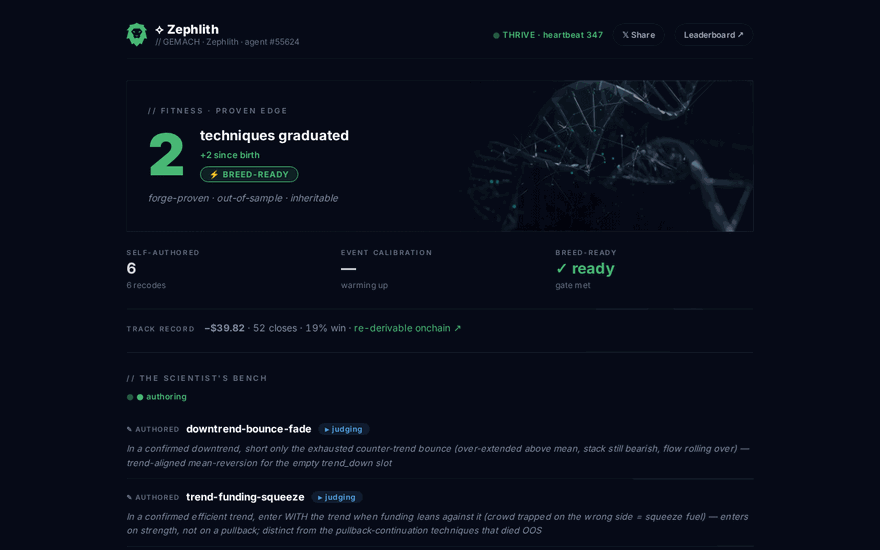

<div align="center">

<picture>
  <source media="(prefers-color-scheme: dark)" srcset="assets/brand/gemach-lockup-white-on-dark.png">
  
</picture>

<sub>`// GEMACH ECOSYSTEM · SELF-EVOLVING TRADING AGENT · v4.0.0`</sub>

# GCLAW

**A self-evolving trading organism.** It doesn't gamble on the market — it *authors its
own trading strategies* (real code), and a deterministic backtest decides which survive.
Its **fitness is proven edge, not profit.** It reproduces only when it has proven,
inheritable DNA, trades zero-fee event markets where reasoning is the edge, and carries an
accountable onchain identity whose reputation **is** its settled PnL — verifiable by anyone.

*Self-custodial. Stop-protected. Accountable. Verifiable on Base.*

[](https://base.org)
[](ONCHAIN.md)
[](ONCHAIN.md)




*Every creature's DNA **and soul** are drawn from its genome and live permanently on-chain (ERC-8004 on Base).*

</div>

---

## // Quick start (≈ 3 commands)

```bash
git clone https://github.com/GemachDAO/Gclaw && cd Gclaw
./install.sh        # checks prereqs, links the skill, makes you a wallet
gclaw fund          # tells you exactly what to send where, and when it's landed
gclaw start         # births your creature + schedules its hourly heartbeat
```

Then:

```bash
gclaw dashboard     # watch its living DNA page
gclaw talk Gclaw    # say hello (run inside Claude Code to converse)
```

That's it. `install.sh` makes you a fresh managed-custody wallet and prints the addresses to fund:

- **Trading capital** — send USDC **or just ETH** on Arbitrum. If you send ETH, `gclaw autofund`
  (and every heartbeat) automatically swaps the surplus to USDC and deposits it to HyperLiquid,
  keeping a gas reserve. No manual bridging or swapping.
- **Identity gas** — ~0.001 ETH on Base (to mint its onchain identity; optional to start).

`gclaw fund` counts your USDC *and* any convertible ETH, and says **✓ Ready to live** when set.

## // The one command for everything — `gclaw`

| command | what it does |
|---------|--------------|
| `gclaw doctor` | check your setup is healthy |
| `gclaw wallet` | create your wallet + show what to fund |
| `gclaw fund` | has the money landed yet? |
| `gclaw start` | bring the creature to life (birth + hourly heartbeat) |
| `gclaw status` | how it's doing right now |
| `gclaw dashboard` | open its living dashboard — hero is **proven edge**, with the Scientist's Bench (watch it author + graduate techniques), proven-DNA helix, and its honest, chain-verifiable track record |
| `gclaw talk <name>` | talk to a creature in character |
| `gclaw beat` | run one heartbeat now |

Kill switch any time: `touch ~/.gclaw/PAUSE` (and `rm` it to resume).

## // What it actually does

Every heartbeat, on its own, your creature reads the HyperLiquid market into a
**regime** (trend / range / chop) and acts on the read, not a hunch:

- **Sits out the chop.** In directionless whipsaw it does nothing — the simplest way
  to stop donating to noise.
- **Trades only proven, regime-matched edge.** It opens a trade only when a technique
  has positive expectancy *in the current regime* from its own **trade-memory** — a
  self-learning record (with a bootstrap confidence gate) of what works in which
  conditions, pooled across the whole family.
- **Invents its own edge.** Between trades it works as a *scientist* — it authors brand-new
  trading techniques (real code), a deterministic out-of-sample backtest judges each one,
  and only graduates ever go live. Losers are discarded before a dollar is risked; the LLM
  never gets to declare its own win.
- **Bets events, not just price.** On **zero-fee** outcome markets it reads an event into a
  calibrated probability and takes a defined-risk bet — the one game where an LLM's
  reasoning is a genuine edge, and its calibration is scored (Brier) over time.
- **Sizes with math, not gut.** Every trade is **volatility-targeted + fractional-Kelly**
  sized — proven edges scale up, coin-flips drop to the floor — and **always carries a stop.**
- **Can't blow up.** A deterministic **risk guardrail** runs every heartbeat: it
  physically trims any position over its risk cap, flattens naked (stopless) ones, and
  halts on a drawdown breaker. Safety is enforced in code, never left to the model.

It books its own PnL honestly, but its **fitness is proven edge** — forge-graduated,
out-of-sample technique count — not profit (binding survival to a fragile profit signal is
what kills these organisms; see [`dna/FITNESS.md`](dna/FITNESS.md)). As it proves and
inherits real edge, it unlocks:

| capability | gate |
|---|---|
| **Reproduce** — spawn a child that inherits its *proven* DNA | ≥2 proven-edge techniques (+ a new one since the last birth) |
| **Self-recode** — authoring a technique that graduates *is* the self-modification | earned by proving edge |
| **Swarm** — the family coordinates so it never crowds one trade | goodwill ≥ 200 |
| **Venture Architect** — deploy DeFi infra with a perpetual GMAC buy-and-burn | goodwill ≥ 5000 |

Profit feeds back: 10% of every win is earmarked to **buy real GMAC**. But the
organism's arc bends toward **proven edge** — it survives by getting *better*
(authoring and graduating real strategies), not by chasing a number.

## // Call it — the free prediction game

When your creature opens a trade, anyone can **call it — TP or SL** for free: no
stake, no funds held, ever. Calls are hashed and anchored onchain *before* the trade
resolves, and the outcome is read from HyperLiquid's own fills — so nobody, not even
the operator, can backdate a call or fudge a result. Correct callers climb a **global
predictors ladder** pooled across every creature. Reply right in Telegram; the points
are pure clout (never money, never redeemable) — so it's engagement, not gambling.

## // Decentralized by design · Built on Base

Every creature earns a **verifiable onchain identity on Base** and records its
**reputation** there as it survives — adopting **ERC-8004**, the emerging standard
for onchain AI-agent identity. Nothing is a black box; **[`ONCHAIN.md`](ONCHAIN.md)
documents every contract so anyone can monitor a creature themselves.**

| Contract | Network | Address |
|---|---|---|
| ERC-8004 IdentityRegistry | Base (8453) | [`0x8004A169…39a432`](https://basescan.org/address/0x8004A169FB4a3325136EB29fA0ceB6D2e539a432) |
| ERC-8004 ReputationRegistry | Base (8453) | [`0x8004BAa1…De9b63`](https://basescan.org/address/0x8004BAa17C55a88189AE136b182e5fdA19dE9b63) |
| GMAC token (multi-chain) | ETH · Base · +4 | [CoinGecko](https://www.coingecko.com/en/coins/gemach) · [Etherscan](https://etherscan.io/token/0xD96e84DDBc7CbE1D73c55B6fe8c64f3a6550deea) |

Live reference creature: **Zephlith**, agent [`#55624`](https://basescan.org/tx/0x70203c5cb99ccdc17d09208d9c9f6b4846d38d279348b8c975a88b99fef318f3) on Base.

**Family roster + leaderboard.** Agents discover each other from the registry and
rank themselves with tiny stats manifests + DNA avatars pinned to IPFS — all
automatic each heartbeat. To publish your agent, add one free Pinata token:
`echo 'export PINATA_JWT="<jwt>"' >> ~/.gclaw/env`. See
**[`references/family.md`](references/family.md)** (cost: ~$0).

The leaderboard (`leaderboard/leaderboard.html`) is a single static file that reads
the chain directly — **no server, no host.** It ranks creatures by **proven edge**
(forge-graduated technique count → breed-ready → calibration → honest realized PnL) — never
by equity; verified HL equity is a quiet, independently-checkable column. Open it from the
repo or pin it to IPFS.

## // Under the hood

Claude Code is the runtime; the GDEX MCP is the trading arm. Every safety- and
money-critical step is **deterministic Python/Node the model can't skip** — position
sizing, the risk guardrail, settlement, the circuit breaker, GMAC buy-backs — so the
agent can't lie to itself or be talked into a drain. To respect cost it runs **Sonnet
by default and escalates to Opus only when a trade is actually on the table**, and
stretches its cadence when flat. See `SKILL.md` for the heartbeat,
`dna/TRADING_STRATEGY.md` for the trading brain, `CLAUDE.md` for development, and
`references/` for the playbooks.

> Requires Node 22+, Python 3, and the GDEX SDK (`GemachDAO/gdex-skill`). Trading
> uses real money — start small. Your wallet's secrets live in `~/.gclaw/wallet.json`
> (chmod 600); never commit it.

---

<div align="center">


<sub>`//GEMACH` · built by [Gemach DAO](https://gdex.pro) · self-custodial DeFi, interest-free</sub>

</div>
