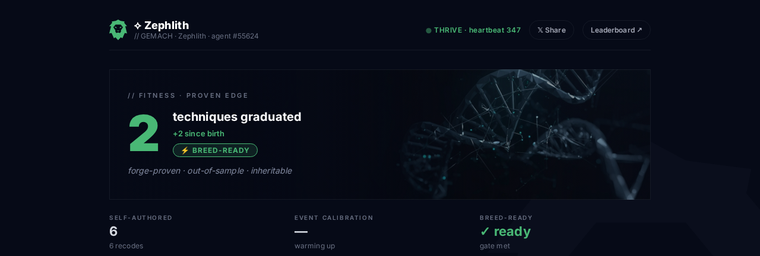

<div align="center">

# 🜃 Gclaw — The Living Trading Agent

**A creature that must trade to survive.** It earns GMAC to stay alive, grows a
personality, reproduces a swarm, earns an onchain identity, and — at the height of
its powers — deploys infrastructure that buys and burns GMAC forever.

*Watch it. Talk to it. Raise it like a pet.*



*Every creature's DNA **and soul** are drawn from its genome and live permanently on-chain (ERC-8004 on Base).*

</div>

---

## Quick start (≈ 3 commands)

```bash
git clone https://github.com/GemachDAO/Gclaw && cd Gclaw
./install.sh        # checks prereqs, links the skill, makes you a wallet
gclaw fund          # tells you exactly what to send where, and when it's landed
gclaw start         # births your creature + schedules its hourly heartbeat
```

Then:

```bash
gclaw dashboard     # watch its living DNA page
gclaw talk Gclaw    # say hello (run inside Claude Code to converse)
```

That's it. `install.sh` makes you a fresh managed-custody wallet and prints the addresses to fund:

- **Trading capital** — send USDC **or just ETH** on Arbitrum. If you send ETH, `gclaw autofund`
  (and every heartbeat) automatically swaps the surplus to USDC and deposits it to HyperLiquid,
  keeping a gas reserve. No manual bridging or swapping.
- **Identity gas** — ~0.001 ETH on Base (to mint its onchain identity; optional to start).

`gclaw fund` counts your USDC *and* any convertible ETH, and says **✓ Ready to live** when set.

## The one command for everything — `gclaw`

| command | what it does |
|---------|--------------|
| `gclaw doctor` | check your setup is healthy |
| `gclaw wallet` | create your wallet + show what to fund |
| `gclaw fund` | has the money landed yet? |
| `gclaw start` | bring the creature to life (birth + hourly heartbeat) |
| `gclaw status` | how it's doing right now |
| `gclaw dashboard` | open its living DNA page |
| `gclaw talk <name>` | talk to a creature in character |
| `gclaw beat` | run one heartbeat now |

Kill switch any time: `touch ~/.gclaw/PAUSE` (and `rm` it to resume).

## What it actually does

Every hour, on its own, your creature: ticks its GMAC life-energy, reads the
HyperLiquid market, and — only with a real edge — opens one small, **always
stop-protected** trade (perps or HIP-3 event markets). It books its own PnL,
earns goodwill, and as goodwill grows it unlocks:

| goodwill | unlocks |
|---|---|
| 50 | **Reproduce** — spawn a child with a mutated strategy and its own soul |
| 100 | **Self-recode** — rewrite its own strategy |
| 200 | **Swarm** — the family coordinates so it never crowds one trade |
| 5000 | **Venture Architect** — deploy DeFi infra with a perpetual GMAC buy-and-burn |

Profit feeds back: 10% of every win is earmarked to **buy real GMAC**. Its whole
arc bends toward one thing — turning earned success into unstoppable GMAC accumulation.

## Decentralized by design

Every creature's DNA lives onchain (ERC-8004 on Base). The leaderboard
(`leaderboard/leaderboard.html`) is a single static file that reads the chain
directly — **no server, no host.** Open it from the repo or pin it to IPFS.

## Under the hood

Claude Code is the runtime; the GDEX MCP is the trading arm; deterministic Python
owns the survival bookkeeping so the agent can't lie to itself. See `SKILL.md` for
the heartbeat, `CLAUDE.md` for development, and `references/` for the playbooks.

> Requires Node 22+, Python 3, and the GDEX SDK (`GemachDAO/gdex-skill`). Trading
> uses real money — start small. Your wallet's secrets live in `~/.gclaw/wallet.json`
> (chmod 600); never commit it.
